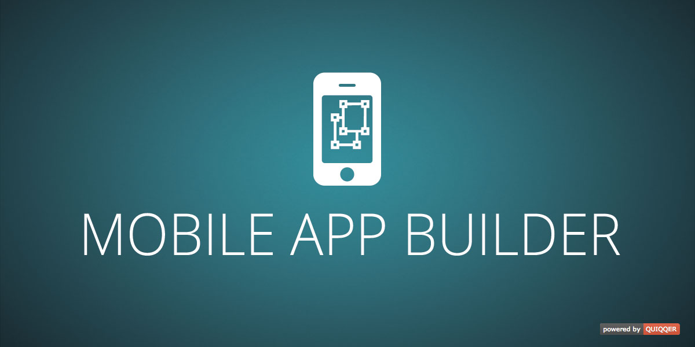

QUIQQER App
========
Package name:

    quiqqer/app

Features
--------
- Create your own Android or iOS App in just 5 minutes
- Generates an Ionic App ([www.ionicframework.com](http://www.ionicframework.com))
- Make your QUIQQER website offline available as an app
- From colors to the logo completely customizable
- Use the generated app immediately or fine-tune it to fit your needs afterwards
- Update the app's content comfortably with the WYSIWYG-Editor inside QUIQQER, without having to release a new app version in the app stores every time
- Earn money by displaying optional ads inside your app 

Installation
------------
The package name is: `quiqqer/app`

Contribute
----------
- Issue Tracker: https://dev.quiqqer.com/quiqqer/app/issues
- Source Code: https://dev.quiqqer.com/quiqqer/app/tree/master
- Wiki: https://dev.quiqqer.com/quiqqer/app/wikis/home

Support
-------
If you found any flaws, have any wishes or suggestions you can send an email
to [support@pcsg.de](mailto:support@pcsg.de) to inform us about your concerns. 
We will try to respond to your request and forward it to the responsible developer.

License
-------
MIT